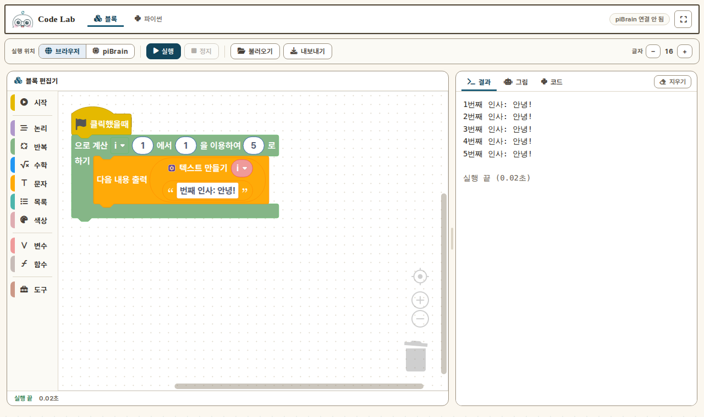
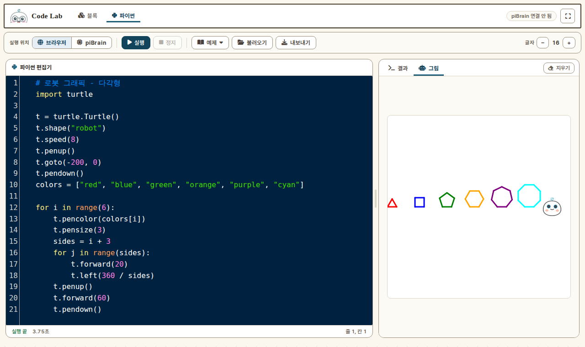
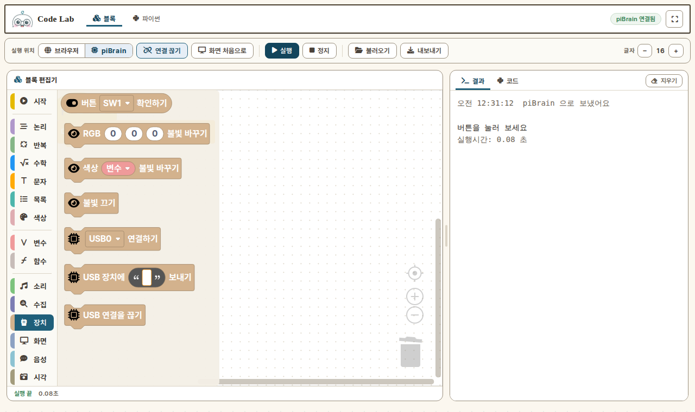

# Code Lab

**블록과 파이썬으로 코딩하고, 브라우저나 piBrain 에서 바로 실행해요.**

설치도 가입도 없습니다. 페이지를 열면 바로 코딩할 수 있고, 작업은 그 브라우저에 자동으로 저장됩니다.
piBrain 을 USB 로 꽂으면 같은 화면에서 로봇 블록(LED·버튼·화면·소리·카메라·음성…)까지 실행할 수 있어요.

**바로 쓰기 → https://themakerrobot.github.io/code-lab/**



## 한눈에 보기

두 가지를 골라서 씁니다.

| | **브라우저**에서 실행 | **piBrain**에서 실행 |
|---|---|---|
| **블록** | 기본 블록으로 연습 | 로봇 블록까지 전부 |
| **파이썬** | `print` · `input` · `turtle`(로봇 그림) | piBrain 의 파이썬 3 + openpibo |
| 필요한 것 | 아무 브라우저 | PC 크롬/엣지 + piBrain + USB 데이터 케이블 |
| 실행 결과 | 결과 탭 · 그림 탭 | piBrain 이 돌려준 출력 (결과 탭) |

- 헤더의 **블록 / 파이썬** 탭으로 편집 방식을 바꿉니다.
- 도구 줄의 **실행 위치**에서 **브라우저 / piBrain** 을 고릅니다.
- **실행** `Ctrl+Enter` · **정지** `Esc` · **바로 저장** `Ctrl+S`

## 블록으로 코딩하기

1. 헤더에서 **블록**을 누릅니다.
2. 왼쪽 분류에서 블록을 끌어다 **시작(깃발) 블록 아래에** 붙입니다.
   시작 블록에 붙지 않은 블록은 흐리게 보이고 실행되지 않아요. 시작 블록은 하나만 둘 수 있어요.
3. **실행**을 누릅니다.

오른쪽 **코드** 탭에서 블록이 만든 파이썬을 볼 수 있어요.
**파이썬으로 고치기**를 누르면 그 코드가 파이썬 편집기로 옮겨지고, **.py** 로 받을 수도 있어요.
블록에서 파이썬으로 넘어가는 다리로 쓰기 좋습니다.

### 블록 분류

| 분류 | 브라우저 | piBrain | 무엇을 하나요 |
|---|:-:|:-:|---|
| 시작 | ● | ● | 깃발 블록 — 프로그램의 시작 |
| 논리 · 반복 · 수학 · 문자 · 목록 · 색상 · 변수 · 함수 | ● | ● | 파이썬 기본 |
| 도구 | ● | ● | 기다리기 · 시간 · 사전 · 형 변환 등 |
| 소리 | | ● | 소리 파일 재생 · 멈춤 |
| 수집 | | ● | 날씨 · 뉴스 · 위키백과 검색 |
| 장치 | | ● | piBrain 버튼 · RGB LED · USB 장치 연결/보내기 |
| 화면 | | ● | OLED 에 글자 · 그림 · 도형 그리기 |
| 음성 | | ● | 음성 인식 · 말하기 · 번역 · 대화 |
| 시각 | | ● | 카메라 읽기 · 사진 저장 · 그림 편집 |
| 인식 | | ● | 얼굴 · 물체 · QR · 포즈 · 손 모양 · 마커 인식 |

실행 위치를 **브라우저**로 두면 브라우저에서 도는 분류만 보입니다.
piBrain 블록이 들어 있는 코드를 브라우저에서 실행하면 "piBrain 에서 실행해 주세요" 라고 알려 줍니다.

> **인터넷이 필요한 블록:** 수집, 음성(음성 인식 · 일부 말하기 · 대화 · 번역), AI 이미지 블록은
> piBrain 안에서 끝나지 않고 서버 API 를 부릅니다. piBrain 이 Wi-Fi 에 연결돼 있어야 해요.
> 블록마다 정확히 어느 것이 서버를 쓰는지는 piBrain OS 에 들어 있는 openpibo 버전에 따라 다릅니다 — **확인 필요**.

## 파이썬으로 코딩하기



1. 헤더에서 **파이썬**을 누릅니다.
2. 코드를 쓰거나 **예제**에서 하나를 고릅니다.
3. **실행**을 누릅니다.

- `input()` 을 쓰면 결과 탭 아래에 입력 칸이 나옵니다. 입력하고 Enter.
- `import turtle` 이 있으면 **그림** 탭이 열립니다. `t.shape("robot")` 으로 파이보 모양 거북이를 쓸 수 있어요.
- 오류가 나면 쉬운 말로 먼저 알려 주고, 그 아래에 원래 오류 메시지를 보여 줍니다.
- 브라우저 실행은 **60초**가 지나면 자동으로 멈춥니다.

### 예제

| 예제 | 배우는 것 |
|---|---|
| 인사하기 | `print` |
| 입력 받기 | `input` · 형 변환 |
| 구구단 | 이중 `for` 문 |
| 함수 만들기 | `def` · 기본값 인자 |
| 리스트 | 인덱스 · 리스트 컴프리헨션 |
| 로봇 그림 — 도형 / 나선 | `turtle` |
| 숫자 맞추기 게임 | `while` · `random` · `break` |

예제를 추가하려면 `lib/examples.js` 에 항목 하나를 더하면 됩니다 (`turtle: true` 면 그림 탭이 열려요).

### 브라우저 실행의 한계

브라우저 실행기는 [Skulpt](https://skulpt.org/) 입니다. 진짜 파이썬 3 와 다른 점이 있어요.

- **한글 변수 · 함수 이름을 못 씁니다.** 파이썬 편집기에서는 영어 이름을 써 주세요.
  블록의 한글 변수 이름은 브라우저에서 실행할 때 자동으로 영어 코드 이름으로 바뀌므로 괜찮습니다.
  (코드 탭에는 한글 그대로 보여 줍니다. piBrain 에서는 한글 이름 그대로 실행돼요.)
- `numpy`, `cv2`, `openpibo` 같은 외부 라이브러리는 없습니다 → piBrain 에서 실행하세요.
- 파일 읽기/쓰기, 네트워크는 안 됩니다.

## piBrain 에서 실행하기



1. piBrain 을 켜고 **USB 데이터 케이블**로 PC 에 연결합니다.
2. 도구 줄 **실행 위치**에서 **piBrain** 을 누릅니다. 소리 · 장치 · 화면 · 음성 · 시각 · 인식 분류가 나타나요.
3. **연결**을 누르고, 뜨는 창에서 piBrain 포트를 고른 뒤 **연결**을 누릅니다.
   헤더 배지가 **piBrain 연결됨** 으로 바뀌면 준비 끝.
4. 블록이나 파이썬 코드를 만들고 **실행**. 출력은 한 줄씩 결과 탭에 나오고,
   끝나면 `실행시간: N.NN 초` 가 표시됩니다.
5. **정지**는 실행 중인 코드를 멈추고 piBrain 화면을 네트워크 정보로 돌립니다.
   **화면 처음으로**는 코드를 멈추지 않고 화면만 네트워크 정보로 돌립니다.

알아 두면 좋아요:

- 실행을 누른 뒤 **약 1초 뒤에** piBrain 이 실행을 시작합니다 (아래 "통신 규약" 참고).
  그동안 실행 버튼은 잠깐 잠깁니다.
- 새로 실행하면 이전에 돌던 코드는 자동으로 멈춥니다.
- 오류 줄 번호는 piBrain 이 코드 앞에 3줄을 덧붙여서 3 크게 나옵니다.
  결과 탭에 `← 내 코드 N번째 줄` 로 바로잡아 함께 보여 줍니다.
- piBrain 은 출력 줄의 앞뒤 공백을 지우고 보냅니다. 들여쓰기로 줄 맞춘 출력은 왼쪽으로 붙어 보여요.
- 케이블을 뽑으면 "연결이 끊겼어요" 가 뜹니다. 다시 꽂고 **연결**을 누르세요.

### 연결이 안 될 때

| 증상 | 확인할 것 |
|---|---|
| **연결** 버튼이 눌리지 않음, 배지가 "크롬·엣지 필요" | PC 의 **크롬 또는 엣지**로 여세요. 사파리 · 파이어폭스 · 폰 · 태블릿은 Web Serial 을 지원하지 않습니다 |
| 포트 고르기 창에 아무것도 없음 | **충전 전용 케이블**일 가능성이 큽니다. 데이터 케이블로 바꿔 보세요. piBrain 부팅이 끝났는지도 확인하세요 |
| "연결하지 못했어요" | 다른 탭이나 프로그램(시리얼 모니터 등)이 같은 포트를 열고 있지 않은지 확인하세요. 한 포트는 한 곳에서만 열립니다 |
| 실행해도 아무 출력이 없음 | piBrain 쪽 `uart_ctrl` 이 돌고 있는지 확인하세요 (piBrain OS 부팅 때 `system/booting.py` 가 자동으로 켭니다) |
| `ModuleNotFoundError: openpibo…` | piBrain OS 의 openpibo 버전이 블록과 맞지 않습니다. OS 를 최신으로 올려 주세요 |

### 통신 규약

장치 쪽 짝은 [openpibo-os.pibrain](https://github.com/themakerrobot/openpibo-os.pibrain) 의 `system/uart_ctrl.py` 입니다.

- 포트: piBrain 의 USB gadget serial `/dev/ttyGS0`, **1000000 baud**
  (USB CDC 라 실제 전송 속도와는 관계없는 명목값입니다. 양쪽 값만 같으면 됩니다.)
- piBrain 은 `readlines()` + `timeout=1` 로 읽습니다. **1초 동안 아무것도 안 오면** 받은 것을 한 덩어리로 처리합니다.

| 보내는 것 | piBrain 이 하는 일 |
|---|---|
| 파이썬 코드 | `/home/pi/.tmp.py` 로 저장하고 실행. 출력을 한 줄씩 돌려주고, 끝나면 `실행시간: N.NN 초` |
| `###END###` | 실행 중인 코드 종료 + 화면을 네트워크 정보로 |
| `###DISP###` | 화면을 네트워크 정보로 |

1초 규칙 때문에 이 페이지는 **모든 보내기 사이를 1.3초 띄웁니다** (`lib/pibrain-serial.js` 의 `GAP_MS`).
띄우지 않으면 "정지 → 곧바로 실행" 이 한 덩어리로 묶여 `###END###` 로 처리되고 코드가 버려집니다.
같은 이유로 코드 안에 `###END###` 나 `###DISP###` 글자가 있으면 보내지 않습니다.

`uart_ctrl.py` 의 동작(덧붙이는 줄 수, 명령 문자열, timeout)을 바꾸면
`lib/pibrain-serial.js` 의 `GAP_MS` · `PRELUDE_LINES` · 명령 문자열도 같이 바꿔야 합니다.

## 저장 · 불러오기 · 내보내기

- **자동 저장**: 블록과 파이썬 코드가 이 브라우저에 따로 저장됩니다. 페이지를 다시 열면 그대로 있어요.
  실행 위치 · 편집 방식 · 글자 크기도 기억합니다.
- **내보내기**: 블록 모드는 `blocks.json`, 파이썬 모드는 `code.py` 로 받습니다.
- **불러오기**: `.json` 은 블록 편집기로, `.py` · `.txt` 는 파이썬 편집기로 엽니다.

자동 저장은 그 컴퓨터의 그 브라우저에만 남습니다. 시크릿 창, 브라우저 기록 삭제,
재부팅하면 초기화되는 교실 PC 에서는 사라지니 **내보내기**로 파일을 챙겨 두세요.

## 개발

### 로컬에서 띄우기

빌드 과정이 없는 정적 페이지입니다.

```bash
python3 -m http.server 8080      # 그리고 http://localhost:8080/
```

`file://` 로 직접 열지 말고 서버로 띄워 주세요.
Web Serial 은 `https://` 또는 `localhost` 에서만 동작합니다.

### 파일 구성

```
index.html
css/
  themaker-ui.css     디자인 킷 복사본 (고치지 말 것 — 아래 "디자인 킷")
  app.css             Code Lab 전용 스타일
  all.min.css         Font Awesome 6.2
lib/
  app.js              화면 · 편집기 · 실행 흐름 (브라우저 실행기 포함)
  pibrain-serial.js   piBrain Web Serial 연결 (보내기 간격 · 줄 단위 받기)
  examples.js         파이썬 예제
blocks/
  customblock.js           블록 모양 정의
  customblock_callback.js  블록 → 파이썬 코드 생성기
  customblock_toolbox.js   분류(툴박스) 구성
  ko2en.js                 분류 이름 한/영
  field-bitmap.js          비트맵 입력 필드
  disable-top-blocks.js    시작 블록에 붙지 않은 블록 비활성화
  svg/                     블록 아이콘
vendor/
  blockly/            Blockly + 한국어 메시지(ko.js) + media
  codemirror/         CodeMirror 5 + python 모드 + cobalt 테마
  skulpt/             Skulpt (로봇 모양 turtle 포함)
assets/fonts/         Pretendard (셀프호스팅)
assets/img/           로고 · 파비콘 · turtle 로봇 원본
webfonts/             Font Awesome 글꼴
docs/                 README 화면 캡처
```

### 블록 추가하기

1. `blocks/customblock.js` — 블록 모양 (`Blockly.defineBlocksWithJsonArray`). 아이콘은 `blocks/svg/`.
2. `blocks/customblock_callback.js` — `Blockly.Python.forBlock['블록이름']` 으로 파이썬 코드 생성.
   import 는 `Blockly.Python.definitions_` 에 넣으면 한 번만 들어갑니다.
3. `blocks/customblock_toolbox.js` — 원하는 분류의 `contents` 에 블록 추가.
4. `vendor/blockly/ko.js` — 블록 문구 `Blockly.Msg["…"]` 추가.

브라우저에서도 돌아야 하는 블록이면 `lib/app.js` 의 `BROWSER_CATEGORIES` 에 든 분류에 넣고,
생성되는 코드가 Skulpt 에서 도는지 확인하세요 (openpibo 를 import 하면 브라우저에서는 막힙니다).

### 캐시

스크립트 · 스타일 주소 끝에 `?v=1` 이 붙어 있습니다.
배포 뒤 학생 브라우저에 옛 파일이 남아 있으면 `index.html` 에서 바꾼 파일의 번호를 올려 주세요.

### 배포

GitHub Pages 가 `main` 브랜치 루트를 그대로 올립니다 (`.nojekyll` 로 Jekyll 처리 없음).
`main` 에 머지하면 1분 안팎으로 반영됩니다. 모든 경로가 상대경로라 하위 경로 배포에서도 동작합니다.

### CI

`.github/workflows/ci.yml`

- **문법** — `lib/*.js`, `blocks/*.js` 를 `node --check`
- **디자인 킷** — `css/themaker-ui.css` 가 킷 원본(태그 고정)과 같은지

## 디자인 킷

화면은 공용 디자인 킷 [themaker-ui](https://github.com/themakerrobot/themaker-ui) 의 "학습지" 테마를 씁니다.
sense-lab · teach-lab 과 같은 헤더 · 버튼 · 패널 · 배지 · 토스트입니다.

- `css/themaker-ui.css` 는 킷 **v1.0.0** 의 복사본입니다. 여기서 고치지 않습니다.
  고칠 것이 있으면 themaker-ui 를 고치고 태그를 올린 뒤 다시 복사하고, CI 의 `KIT=` 번호를 바꿉니다.
- Code Lab 에만 있는 것(도구 줄 · 편집기 · 결과 탭 · 입력 줄 · turtle)은 `css/app.css` 에 둡니다. 색은 킷 토큰만 씁니다.
- 예외: 코드 편집기 안쪽(cobalt 어두운 테마)과 블록 색은 눈에 익은 기존 색을 유지합니다.

## 라이선스

Code Lab 코드는 [MIT](LICENSE) 입니다.

### 포함된 오픈소스

| 구성 요소 | 라이선스 |
|---|---|
| [Blockly](https://github.com/google/blockly) | Apache 2.0 |
| [Skulpt](https://github.com/skulpt/skulpt) | MIT |
| [CodeMirror 5](https://codemirror.net/5/) | MIT |
| [Font Awesome Free 6.2](https://fontawesome.com/) | 아이콘 CC BY 4.0 · 글꼴 SIL OFL 1.1 · 코드 MIT |
| [Pretendard](https://github.com/orioncactus/pretendard) | SIL OFL 1.1 |

각 구성 요소는 자기 라이선스를 따릅니다 (`vendor/`, `assets/fonts/`, `css/all.min.css`, `webfonts/`).
